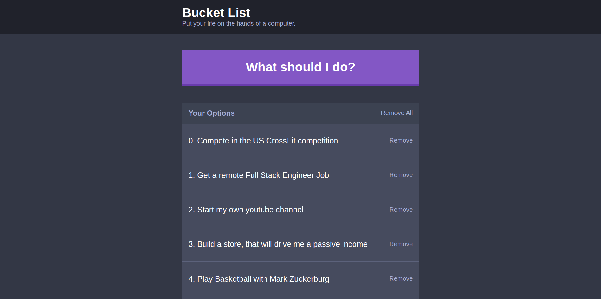

# Bucket List

> This project is kind of like a todo list but it's a little bit different. Because this is a bucket list a list that people put in thier wishes to do and from now and then they pick one wish to work on or achieve. This project help users do the same thing by saving there wishes and help them pick there next adventure (or wish). For now it's a small app but I'm sure I will make it bigger on the future, depends on the users feedback.



## Built With

- Vanilla JavaScript,
- the CSS preprocessor SCSS,
- webpack,
- babel,
- stylelint,
- ESlint

## Live Demo

[Live Demo](https://www.zakariaeelmejdki.com/bucket-list/)

## Getting started

### Prerequisites

In order to have this project up and running you will need:

- NodeJS 10+

### Setup

First, you need to clone this project using one of the links above, using this command:

```
git clone RESPOSITRY_LINK
```

Then you should run: `npm install`

And afterward, you supposed to run: `npm run serve`, to run the project in your local machine.

Then head to the localhost on port 3030 `https://localhost:3030`

Congrats the project is fully working.

### Deployment

For deployment, I used GitHub pages, but as you see my project is full of files and the `index.html` file is inside the `build/` folder, so in order to deploy using GitHub pages we need to put the `index.html` file in the root of the repository, in order to do this we will use a simple trick, please follow the commands below if you want to deploy on your own repository:

- If you have the `build/`  folder declared inside the `.gitignore`  file please remove it from there.

- run `npm run build`  to generate the build folder.

- then make sure that git knows about your subtree, using this command:

  ```
  git add build && git commit -m "Initial build subtree commit"
  ```

- after that use subtree push to send it to gh-pages branch in GitHub:

  ```
  git subtree push --prefix build origin gh-pages
  ```

  Now you have finished you can check the link to GitHub pages you will find your project deployed there. you can find the link on the repository settings page.

## Author

👤 **Zakariae El Mejdki**

- Github: [@elmejdki](https://github.com/elmejdki)
- Twitter: [@zakariae_elmejdki](https://twitter.com/zakariaemejdki)
- Linkedin: [El Mejdki Zakariae](https://www.linkedin.com/in/zakariaeelmejdki/)

## 🤝 Contributing

Contributions, issues and feature requests are welcome!

Feel free to check the [issues page](https://github.com/elmejdki/Weather-app/issues).

## Show your support

Give a ⭐️ if you like this project!

## 📝 License

This project is [MIT](lic.url) licensed.